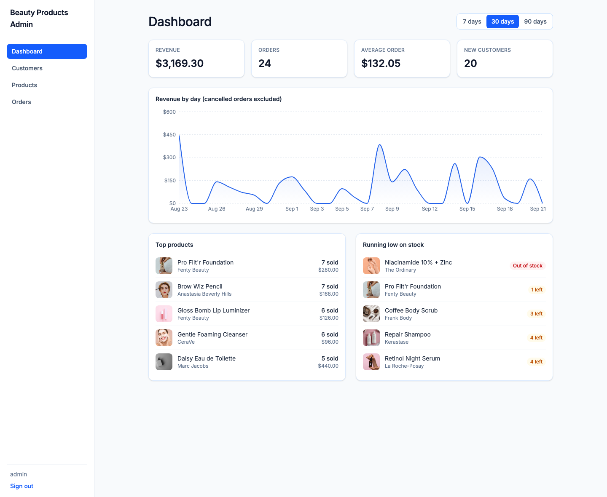
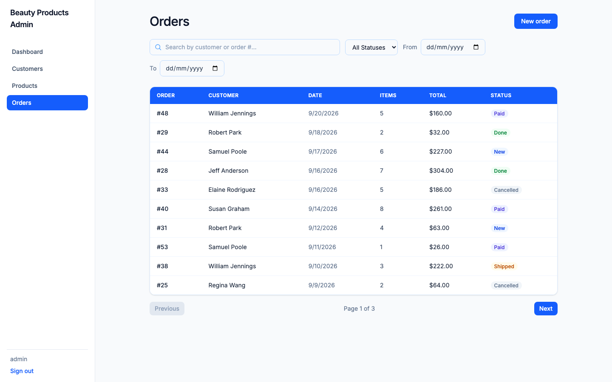
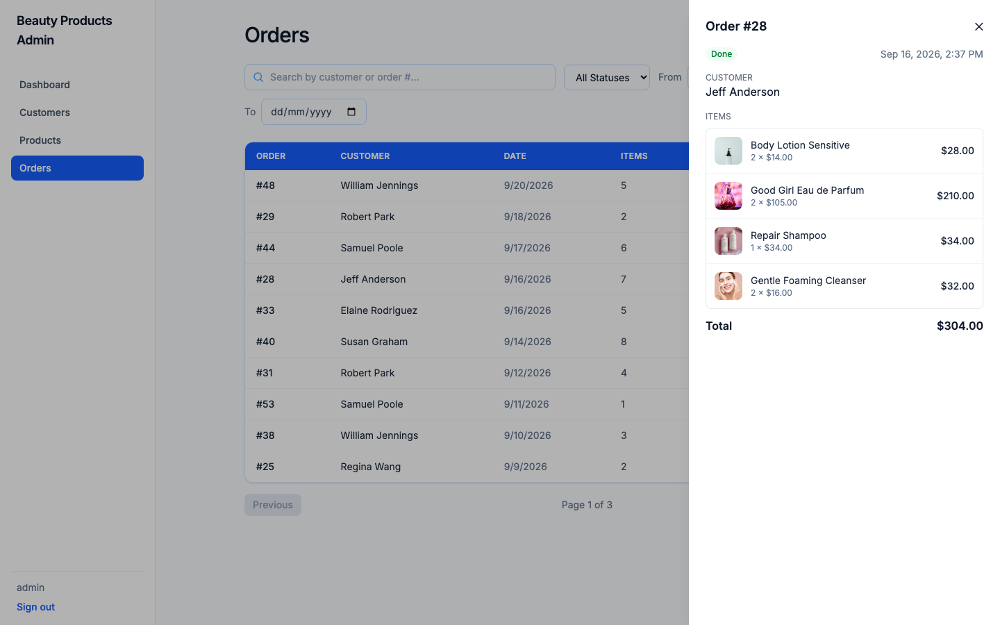
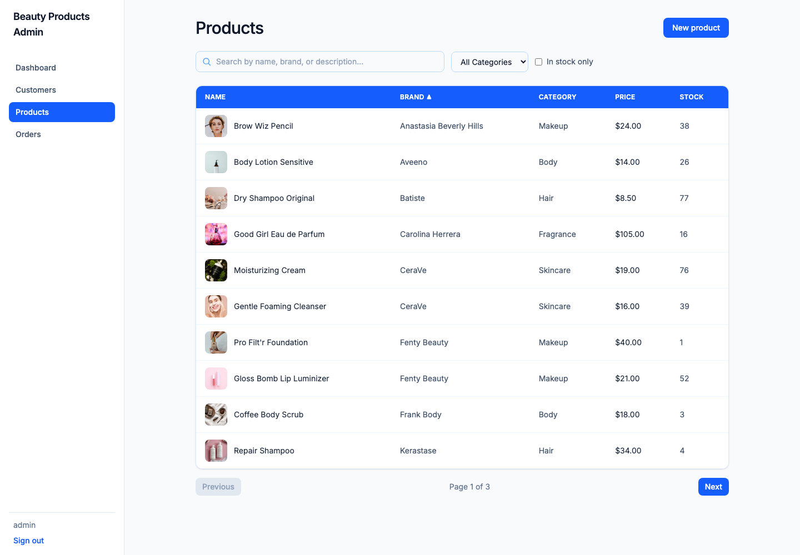
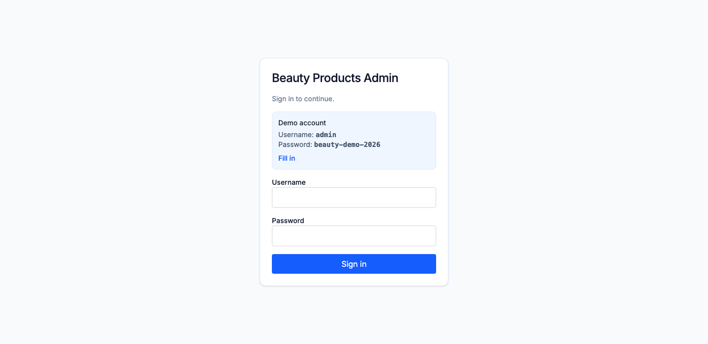

# Beauty Products Admin

A full-stack admin panel for a beauty products store. Manage customers, products and orders,
and follow sales on a dashboard.

**Live demo:** https://admin-products-shop.vercel.app · the demo login is shown on the sign-in page

> The API runs on Render's free plan and sleeps when idle, so the first request after a pause can take about a minute.



| Orders | Order details |
|---|---|
|  |  |






## Features

- **Customers**: search, sorting, pagination, create / edit / delete, order history in the customer card
- **Products**: photos, filters by category and availability, stock tracking, create / edit / delete
- **Orders**: pick a customer and products, live total, status workflow
  (`new → paid → shipped → done`), cancelling an order returns its items to stock
- **Dashboard**: revenue, orders, average order, new customers, revenue chart,
  top products, low-stock list, 7 / 30 / 90 day periods
- **Auth**: JWT login with automatic token refresh; every page and API endpoint is protected

## Tech stack

| Layer    | Tools |
|----------|-------|
| Backend  | Python, Django, Django REST Framework, PostgreSQL, django-filter, SimpleJWT, gunicorn, WhiteNoise |
| Frontend | React, TypeScript, Vite, React Router, TanStack Query, React Hook Form + Zod, Tailwind CSS, Recharts |
| Infra    | Docker Compose (`db`, `backend`, `frontend` served by nginx) |

## Design notes

- **Orders are transactional.** Creating an order locks the products (`select_for_update`),
  checks stock, deducts it and calculates the total in one transaction. If anything is missing
  the request fails with a clear error and nothing changes. Locks are always taken in primary-key
  order, so orders containing the same products can't deadlock. Covered by concurrency tests.
- **Price history is preserved.** The product price is copied into each order item, so changing
  a price later doesn't rewrite old orders.
- **No N+1 queries.** Order lists use `select_related` / `prefetch_related`; a test asserts the query count.
- **State lives in the URL.** Search, filters, sorting, page and the open record survive reloads and back/forward.
- **Safe deletes.** Customers and products that appear in orders can't be deleted (HTTP 409 with a readable message).
- **Token handling.** The API client attaches the access token, and when several requests fail with
  401 at once they share a single refresh call and are then retried.

## Run with Docker

Requires Docker Desktop. From the project root, create your local settings first
(`.env` is git-ignored; edit the passwords and generate a secret key as described inside):

```bash
cp .env.example .env
docker compose up --build
```

| Service    | URL                          | Notes |
|------------|------------------------------|-------|
| `frontend` | http://localhost:3000        | React app (nginx) |
| `backend`  | http://localhost:8000/api/   | API (gunicorn); migrations and the admin user are created on start |
| `db`       | localhost:5433               | PostgreSQL 16 (host port 5433 to avoid clashing with a local Postgres) |

The database starts empty. Fill it with demo data:

```bash
docker compose exec backend python manage.py seed_demo
```

Then sign in at http://localhost:3000 with the `DEMO_ADMIN_USERNAME` / `DEMO_ADMIN_PASSWORD`
from your `.env`.

## Run without Docker

You need a running PostgreSQL instance.

**Backend**

```bash
cd backend
python3 -m venv venv
source venv/bin/activate
pip install -r requirements.txt
cp .env.example .env        # fill in real values
python manage.py migrate
python manage.py create_demo_admin
python manage.py seed_demo
python manage.py runserver
```

**Frontend**

```bash
cd frontend
npm install
npm run dev
```

The frontend runs on http://localhost:3000 and reads the API address from `frontend/.env`
(`VITE_API_URL=http://localhost:8000/api`).

## Management commands

| Command | What it does |
|---------|--------------|
| `create_demo_admin` | Creates (or resets the password of) the login user. Uses `--username/--password` or `DEMO_ADMIN_USERNAME/DEMO_ADMIN_PASSWORD`. With `DEBUG` off a password is required. |
| `seed_demo` | Fills an **empty** database with products, customers and orders; does nothing if data exists. `--reset` (or `DEMO_RESET=true`) wipes customers, products and orders first and seeds again; login users are kept |
| `seed_products` | 25 beauty products with photos (safe to run repeatedly) |
| `seed_customers --count N` | N fake customers |
| `seed_orders --count N` | N fake orders spread over the last 30 days |

## API

All endpoints except login require `Authorization: Bearer <access token>`.

| Method | Endpoint | Purpose |
|--------|----------|---------|
| POST | `/api/auth/login/` | Get access and refresh tokens |
| POST | `/api/auth/refresh/` | Get a new access token |
| GET | `/api/auth/me/` | Current user |
| GET, POST | `/api/customers/` | List (search, ordering, pagination) / create |
| GET, PATCH, DELETE | `/api/customers/{id}/` | Retrieve / update / delete |
| GET, POST | `/api/products/` | List (search, `category`, `in_stock`, ordering) / create |
| GET, PATCH, DELETE | `/api/products/{id}/` | Retrieve / update / delete |
| GET, POST | `/api/orders/` | List (search, `status`, `customer`, `date_from`, `date_to`, ordering) / create |
| GET, PATCH | `/api/orders/{id}/` | Retrieve / change status or comment (orders can't be deleted) |
| GET | `/api/stats/summary/?days=7\|30\|90` | Revenue, orders, average order, new customers |
| GET | `/api/stats/revenue-by-day/?days=` | Daily revenue for the chart |
| GET | `/api/stats/top-products/?days=` | Best-selling products |
| GET | `/api/stats/low-stock/` | Products with 5 or fewer items left |

Cancelled orders are excluded from all revenue figures.

## Tests

```bash
cd backend
source venv/bin/activate
python manage.py test
```

Covers order creation and rollback on missing stock, price snapshots, cancelling and status
transitions, filters, statistics, query count, protected deletes, seeding, and authentication.

`orders/test_concurrency.py` checks the race conditions with real parallel database connections:
two buyers of the last item (exactly one succeeds), eight buyers of three items (never oversold),
and orders that lock the same products in opposite order (no deadlock). Without the row locking in
`orders/services.py` these tests fail: the eight buyers all get their order for three items.

## Environment variables

Backend (`backend/.env`, see `backend/.env.example`; Docker Compose sets its own values):

| Variable | Purpose |
|----------|---------|
| `DJANGO_SECRET_KEY` | Django secret key (required) |
| `DJANGO_DEBUG` | `true` for development; defaults to `false` |
| `DJANGO_ALLOWED_HOSTS` | Comma-separated hostnames in production |
| `CORS_ALLOWED_ORIGINS` | Comma-separated frontend origins in production (localhost is always allowed) |
| `POSTGRES_DB`, `POSTGRES_USER`, `POSTGRES_PASSWORD`, `POSTGRES_HOST`, `POSTGRES_PORT` | Database connection |
| `POSTGRES_SSLMODE` | `require` for hosted databases such as Neon; defaults to `prefer` |
| `DEMO_ADMIN_USERNAME`, `DEMO_ADMIN_PASSWORD` | Login created by `create_demo_admin` |
| `DEMO_RESET` | `true` makes `seed_demo` wipe and reseed demo data on every start (handy for a public demo) |

Frontend: `VITE_API_URL`, the API base URL (defaults to `/api`). Optional `VITE_DEMO_USERNAME` and
`VITE_DEMO_PASSWORD` show a demo account box on the sign-in page (public: use a throwaway account only).

## Deployment

The repo is set up for **Vercel** (frontend) + **Render** (backend) + **Neon** (PostgreSQL):

- `render.yaml`: Render Blueprint for the API. It runs migrations, creates the admin user and
  seeds an empty database on start.
- `frontend/vercel.json`: makes deep links such as `/orders` work after a page refresh.
- Set `VITE_API_URL` in Vercel to `https://<your-render-domain>/api`, and add the Vercel domain to
  `CORS_ALLOWED_ORIGINS` on Render.

On Render's free plan the service sleeps after 15 minutes without traffic, so the first
request after a pause can take about a minute.

## Project structure

```
.
├── docker-compose.yml
├── render.yaml
├── backend/
│   ├── config/         # settings, urls, exception handler
│   ├── accounts/       # JWT login endpoints, create_demo_admin
│   ├── customers/      # customer API
│   ├── products/       # product API, seed_products
│   └── orders/         # orders, order services (transactions), stats, seed_orders, seed_demo, tests
└── frontend/
    └── src/
        ├── api/        # axios client with token refresh, API calls
        ├── auth/       # token storage, AuthProvider, RequireAuth
        ├── components/ # tables, drawers, forms, chart
        ├── hooks/      # TanStack Query hooks
        ├── pages/      # Dashboard, Customers, Products, Orders, Login
        ├── schemas/    # Zod validation
        └── types/
```

## Known limitations

- A single admin role: no roles or permissions
- No payments, delivery or multi-currency
- Product images are URLs (stock photos from Pexels), not file uploads
- Search uses `icontains`, not full-text search, which is enough at this scale
- Tokens are kept in `localStorage`; httpOnly cookies would be safer against XSS but need CSRF handling
